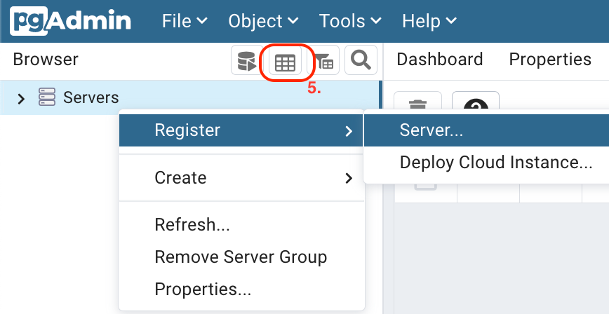
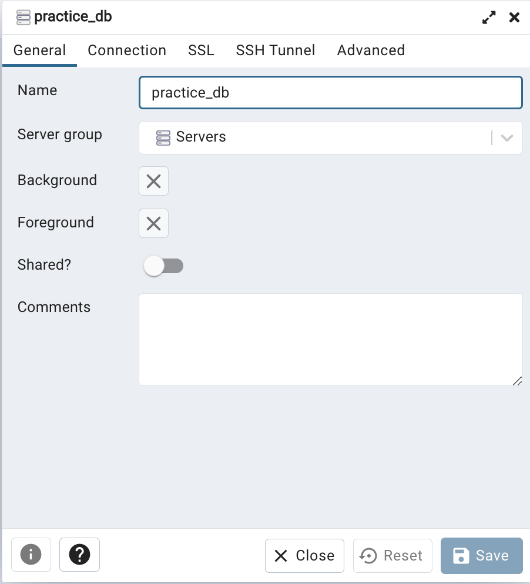
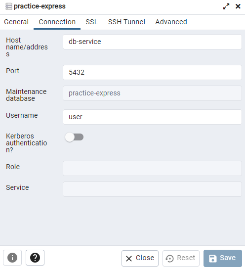

# practice-express
- SPA開発の練習を目的とし、web周りの学習を兼ね実装
- シンプルなSNSライクのAPIで構成
___

## 利用環境
- Linux環境（手順は変わるがWindowsでも可）
- Dockerがインストール済みであること

## サーバーの起動方法
```
$ bash start.sh
```

### 初回起動(環境構築)
モジュールのインストールとDBの構築
```
$ npm i
$ npm run init:db
```

### Webサーバ起動
```
$ npm start
```

### サーバーの停止方法
- 「Ctrl + C」でスクリプトの実行を停止
- `exit`コマンドを実行し、nodeコンテナから抜ける。

## 動作確認
- 利用可能なAPIは、[DB設計](#設計情報)を参照
- 登録情報の確認は、[DB管理ツール利用方法](#db管理ツール利用方法)を参照

### curlを利用

#### 1. ユーザー登録
```
$ curl -XPOST -H 'Content-Type: application/json' -d '{"user_name": "test", "email": "test@test.com", "password": "test"}' -i localhost:8080/user
```
レスポンスヘッダーのsession_idは、以降、GETメソッド以外のアクセスでおおよそ必須
```
Set-Cookie: session_id=XXXXXXXXXX;
```

#### 2. ツイート
```
$ curl -XPOST -H 'Content-Type: application/json' -d '{"message": "test"}' -b 'session_id=XXXXXXXXXX' -i localhost:8080/tweet
```

#### 3. ツイート詳細
```
$ curl localhost:8080/tweet/1
```

#### 4. ログアウト
```
$ curl -XDELETE -b 'session_id=XXXXXXXXXX' -i localhost:8080/logout
```
※ブラウザ想定で簡単のため、cookieの有効期限を見ていないことに注意

### 静的ファイルを格納
publicディレクトリ下に該当ファイルを格納することで利用可能

___

## 設計情報


- [API設計](https://docs.google.com/spreadsheets/d/1dszmDHifASGQMDyBLVrZOB6KvdG3vVnUZawoQbB7GQo/edit?usp=sharing) (Google スプレッドシート)
- [DB設計](https://docs.google.com/spreadsheets/d/1MhOT3dtFqDXTU8DcI92KUJz8gfzLNuqZS16lS9t31Do/edit?usp=sharing) (Google スプレッドシート)

___

## DB管理ツール利用方法
ブラウザ版pgAdmin4を利用

#### 1. `localhost:8888`にアクセス

#### 2. Email及びPasswordは以下の通り
- test[]()@test.com
- password

#### 3. 新規サーバーを登録（赤枠は5の内容）


#### 4. 登録情報はおおよそ以下の図の通りで、Passwordは`password`
<table>
<tr>
<td>

</td>
<td>

</td>
</tr>
</table>

#### 5. 対象のテーブルを選択し、3で参照した図で赤枠で囲まれたアイコン(View Data)を押下することで、内容の確認が可能
※テーブル群はサイドバーの以下パスに存在
Servers/practice_db/Databases/db_name/Schemas/public/Tables
