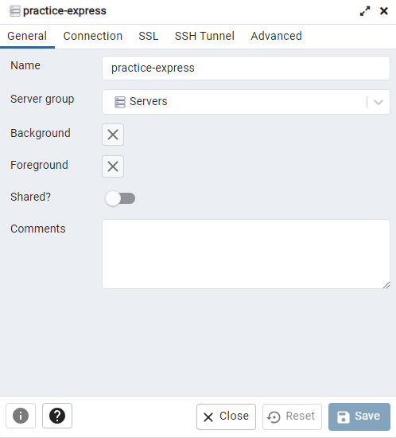

# practice-express
- SPA開発の練習を目的とし、web周りの学習を兼ね実装
- シンプルなSNSライクのAPIを返す設計
- 今後追加予定の機能
  - CSRF対策
  - SSL化
  - cronでバッチ処理（期限切れsession_idを削除）
  - エラーメッセージのI18N化

___

## 使用方法
前提：Dockerがインストール済みであること

### サーバーの起動方法

#### 1. コンテナの起動
```
$ docker-compose up -d
```

#### 2. webサーバーの起動
nodejs-expressコンテナに入り、作業ディレクトリに移動
```
$ docker exec -it practice_web bash
$ cd /var/src
```

○初回起動時  
モジュールのインストールとDBの構築
```
$ npm install
$ node server.js init_db
```

○通常起動
```
$ npm run start
```

### サーバーの停止方法

#### 1. webサーバーの停止
- 「Ctrl + C」でnodeの実行を停止
- `exit`コマンドを実行し、nodejs-expressコンテナから抜ける。

#### 2. コンテナの停止
```
$ docker-compose down
```

---

## 動作確認
- 利用可能なAPIは、[DB設計](##設計情報)を参照
- 登録情報の確認は、[DB管理ツール利用方法](##DB管理ツール利用方法)を参照

### curlを利用

#### 1. ユーザー登録
```
$ curl -XPOST -H 'Content-Type: application/json' -d '{"user_name": "test", "email": "test@test.com", "password": "test"}' -i localhost:8080/user
```
レスポンスヘッダーのsession_idは、以降、GETメソッド以外のアクセスでおおよそ必須
```
Set-Cookie: session_id=XXXXXXXXXX;
```

#### 2. ツイート
```
$ curl -XPOST -H 'Content-Type: application/json' -d '{"message": "test"}' -b 'session_id=XXXXXXXXXX' -i localhost:8080/tweet
```

#### 3. ツイート詳細
```
$ curl localhost:8080/tweet/1
```

#### 4. ログアウト
```
$ curl -XDELETE -b 'session_id=XXXXXXXXXX' -i localhost:8080/logout
```
※ブラウザ想定で簡単のため、cookieの有効期限を見ていないことに注意

### 静的ファイルを格納
publicディレクトリ下に該当ファイルを格納することで利用可能

___

## 設計情報


- [API設計](https://docs.google.com/spreadsheets/d/1dszmDHifASGQMDyBLVrZOB6KvdG3vVnUZawoQbB7GQo/edit?usp=sharing)
- [DB設計](https://docs.google.com/spreadsheets/d/1MhOT3dtFqDXTU8DcI92KUJz8gfzLNuqZS16lS9t31Do/edit?usp=sharing)

___

## DB管理ツール利用方法
ブラウザ版pgAdmin4を利用

#### 1. `localhost:8888`にアクセス

#### 2. Email及びPasswordは以下の通り
- pgadmin@email.jp
- pgadmin_password

#### 3. 新規サーバーを登録（赤枠は5の内容）


#### 4. 登録情報はおおよそ以下の図の通りで、Passwordは`db_password`



#### 5. 対象のテーブルを選択し、3で参照した図で赤枠で囲まれたアイコン(View Data)を押下することで、内容の確認が可能
※テーブル群はサイドバーの以下パスに存在
Servers/practice_db/Databases/db_name/Schemas/public/Tables